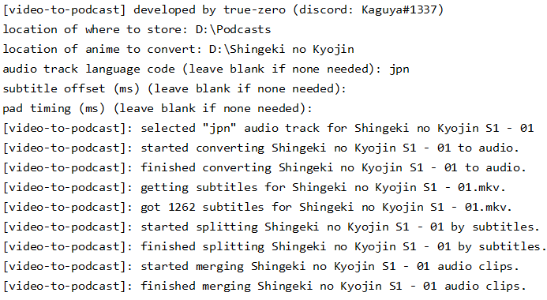
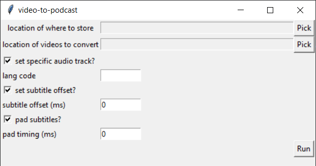

video-to-podcast
================
Convert your videos into podcasts.

<i>Running in command-line mode.</i>

<i>Running in graphical user-interface mode.</i>

---

## Features
* Supports all major platforms: Windows, Mac, Linux.
* Automatically finds downloaded subtitles and matches to the episode.
* Automatically extracts subtitles from mkv files.
* Utilises multi-threading to process multiple videos in parallel.
* Replicates the given folder structure.
* Chunks nearby subtitles to avoid constant awkward cuts.

---

## Installation guide
- Scroll to the bottom of the page and install the latest Python 3.x version from [here](https://www.python.org/downloads/release/python-374/).
    - Note for Windows users: when installing Python make sure you check "Add Python 3.x to PATH"
- Install the latest version of "video-to-podcast" from [here](https://github.com/true-zero/video-to-podcast/archive/master.zip).
- Unpack the "video-to-podcast" archive to a folder.
- Run `python -m pip install anitopy` in the terminal.
- **Important for Linux distro users**: If you are running a linux distro (e.g. Ubuntu or Debian) you need to install ffmpeg before using this tool.

## How to use - UI mode
- Run `cd [location of video-to-podcast]` in the terminal.
- Run `python run_ui.py`

## How to use - CLI mode
- Run `cd [location of video-to-podcast]` in the terminal.
- Run `python run_cli.py`
- Enter the path to where you want the audio files to be stored.
    - Note: This directory must already exist, the program will not create it for you.
- Enter the path to the video you want to convert.
    - Note: Recommended that you do it season by season unless you have an organised folder structure.
- Enter the language code of the audio track you want.
    - Note: This is only used for **mkv** files since they can support multiple tracks.
- Enter the amount to offset the subtitles by.
    - Note: This is useful when the subtitles are all out of sync by a fixed amount.
- Enter the amount to pad the subtitles by.
    - Note: This is useful when the subtitles are not timed perfectly and you want to avoid missing audio.    

---

## License
>You can check out the full license [here](LICENSE)

This project is licensed under the terms of the **MIT** license.

